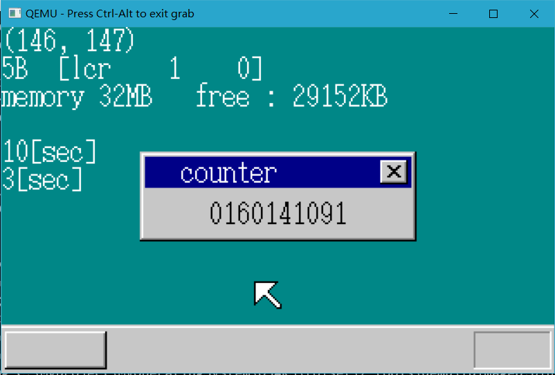

# MyOpreatingSystem

这是我关于自制操作系统的一个尝试，按照《30天自制操作系统》这本书的教程试着完成一个操作系统以下清单按照我自己的进度而非书上的进度

目前并不理解“为什么这样写”，特别是对于汇编的部分， 还处于照猫画猫的阶段， 但会不定时停下来回顾已完成的部分，并将学习理解的过程总结到对应的文件夹中，希望能逐步理解。

-   第一天 打印helloworld

-   第二天 完成简单的显示

-   第三天 完成底层的键盘中断（示意图中左上角第二行显示的是键码）

-   第四天 利用FIFO加速中断并且完成鼠标的移动

之前的naskfunc中的stihlt函数前面少了个下划线

今天主要是利用循环队列FIFO来加快中断的处理，在提高了中断的处理能力之后，将其封装出来，便于进行鼠标的中断。今天开始维护这个项目，并且要填一填前三天留下的坑。今天到此结束，明天开始解读asmhead，并补齐前三天的制作过程。

-   第五天 内存管理

今天的主要内容是内存管理，先禁止缓存，然后反复读写内存，以此达到检查内存的目的，然后建立一个结构体数组，记录当前内存的情况。然后编写函数，对结构体操作，以达到管理内存的目的

-   第六天 叠加处理，增加图层，简单窗口

今天的开发设计大量的优化与算法，虽然不难，但很杂，码量很大，以后需要回过头来再看这部分。

增加图层来进行叠加处理是很聪明的一种做法，易于实现和维护，图层叠加时的刷新方式直接影响着操作和视觉的流畅度，总的思路就是刷新的地方越少越好。

有了图层之后，窗口的出现就有了条件，只要绘制窗口的图案与一个图层上，再加入这个图层就ok了

今天开始网课了，时间开始变得不那么充裕，今天发生的一些事也让心里感觉累累的，暂且搁置一会儿，换换状态。

-   第七天 提高图层刷新速度

今天通过尽量减小刷新的区域，解决了当高速刷新图层时窗口闪烁的问题。

-   第八天 完成基础定时器,基于定时器实现鼠标的闪烁

-   第九天 继续优化定时器

今天做了简化字符串显示,整合了FIFO缓冲区,利用链式线性表加快了中断处理的速度

-   第十天 提高分辨率

今天修改asmhead，提高了分辨路。增加了文本的输入，完成了窗口的移动。

