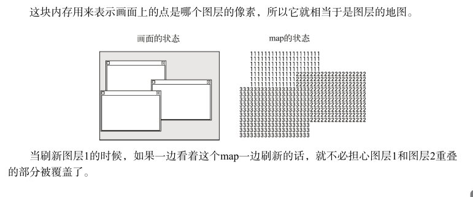

# 1. 引入高速计数器，提出刷新闪烁的问题

将窗口中的内容改为打印count的值

### 消除闪烁（1）

思路：减少刷新的区域，不刷新背景，只刷新窗口和鼠标

修改sheet.c的sheet_refreshsub函数

给该函数加上一个h0参数，只对在此参数以上的图层进行刷新

修改关于该函数的调用

修改的内容很少，我们逐一来看一下。对于sheet_refresh函数，我们按照刚才的思路让它只刷新指定的图层和它上面的图层。 在sheet_slide函数里，图层的移动有时会导致下面的图层露出，所以要从最下面开始刷新。
另一方面，在移动目标处，比新移来的图层位置还要低的图层没有什么变化，而且只是隐藏起来 了，所以只要刷新移动的图层和它上面的图层就可以了。 在sheet_updown函数里，按照同样的思路，针对个别不需要自下而上全部刷新的部分只进行局部刷新。这样修改以后，闪烁现象应该就会消失了

这样闪烁的问题就解决了，但是鼠标一动就出了问题，当把鼠标放在该窗口上时，鼠标不断地闪烁。

如果能解决这个问题，以后刷新窗口时就不需要重绘鼠标了

我们采取下面的方法：首先，开辟一块内存，大小和VRAM一样，我们先称之为map。

下面我们向map中写入1，2等图层号码的函数。

创建sheet_refreshmap这个函数与以前的refreshsub函数基本一样，只是用色号代替了图层号码而已。代表图层号码的变量sid是“sheet lD“的缩写。

下面是sheet_refreshsub函数。我们对它进行改写，让它可以使用map

现在我们来修改调用了sheet_refreshsub的3个函数

在sheet_refresh函数里，由于图层的上下关系没有改变，所以不需要重新进行refreshmap的处理。实际上，我们有时候要把透明的地方变成不透明的，或者反过来要把不透明的地方变成透明 的，遇到这些情况就必须重新编写map了，不过这里的sheet_refreshrefresh函数没有考虑这些情况。 如果需要实现这样的功能，就要再编写其他的函数。 另外，在sheet_refresh函数里，需要刷新的图层只有一张，所以速度应该比较快。 在sheet_slide函数里，首先重写map，分别对应移动前后的图层，然后调用sheet_refreshsub函数。在移动前的地方，只针对上层图层移走之后而露出的下层图层进行重绘就可以了。在移动目 的地处仅重绘了一张移动过去的图层